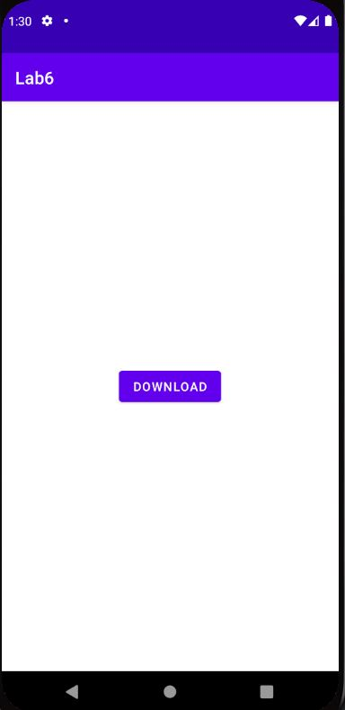

# Лабораторная работа №6. Многопоточные Android приложения.

## Цели
Получить практические навыки разработки многопоточных приложений:
1. Организация обработки длительных операций в background (worker) thread:
    * Запуск фоновой операции (coroutine/asynctask/thread)
    * Остановка фоновой операции (coroutine/asynctask/thread)
2. Публикация данных из background (worker) thread в main (ui) thread.

Освоить 3 основные группы API для разработки многопоточных приложений:
1. Kotlin Coroutines
2. AsyncTask
3. Java Threads

## Задачи
### Задача 1. Альтернативные решения задачи "не секундомер" из Лаб. 2
Необходимо использовать приложение "не секундомер", получившееся в результате выполнения [Лабораторной работы №2](../02/TASK.md), и разработать несколько альтернативных приложений "не секундомер", отличающихся друг от друга организацией многопоточной работы. 

#### Java Threads
Листинг JavaThreads:

      const val SECONDS = "seconds"

      class JavaThreads : AppCompatActivity() {
          var secondsElapsed: Int = 0
          var backgroundThread: Thread? = null
          private  lateinit var prefs: SharedPreferences

          private fun update() = textSecondsElapsed.post {
              textSecondsElapsed.text = "Second elapsed: " + secondsElapsed++
          }

          override fun onCreate(savedInstanceState: Bundle?) {
              super.onCreate(savedInstanceState)
              setContentView(R.layout.activity_main)
              prefs = getSharedPreferences(SECONDS, Context.MODE_PRIVATE)
          }

          override fun onStart() {
              super.onStart()
              if (prefs.contains(SECONDS))
                  secondsElapsed = prefs.getInt(SECONDS, 0)
          }

          override fun onResume() {
                  backgroundThread = Thread {
                      try {
                          while (!Thread.currentThread().isInterrupted) {
                              Thread.sleep(1000)
                              update()
                          }
                      } catch (e: InterruptedException) {
                      }
                  }.also {
                      it.start()
                  }
              super.onResume()
          }

          override fun onPause() {
              backgroundThread?.interrupt()
              prefs.edit().putInt(SECONDS, secondsElapsed).apply()
              super.onPause()
          }
      }

Вынесу обновление UI в отдельную функцию update(). 

В методе onResume() инициализирую фоновый поток, запускаю его, а в методе onPause() прерываю. Сам по себе вызов backgroundThread?.interrupt() не освободит созданный поток - он продолжит считать секунды где-то в памяти. При отсутствии строки while (!Thread.currentThread().isInterrupted) { ... } приложение будет каждый раз создавать новый поток при попадании в состояние onResume, в следствие чего, каждый из потоков будет прибавлять 1 к счётчику, и он будет работать некорректно. Поэтому перед созданием нового потока проверяю, что предыдущий был освобождён с помощью метода isInterrupted. 

Добавила блок try..catch, так как при установленном флаге interrupted метод Thread.sleep(1000) кидает исключение InterruptedException.

Также добавила переменную prefs с типом SharedPreferences в этот и все остальные варианты реализации фоновых потоков. Данный класс автоматически создаёт файл в папке приложения и хранит данные в виде пар «ключ — значение». Сохраняю в этом файле информацию о количестве пройденных секунд, чтобы при открытии приложения счётчик не сбрасывался, а продолжал работу. В данном случае уместнее использовать SharedPreferences нежели onSaveInstanceState() с onRestoreInstanceState(), так как эти методы не вызываются при явном закрытии приложения и используются для кратковременного хранения информации. 

#### AsyncTask
Листинг AsyncTask:

      class AsyncTask: AppCompatActivity() {
          var secondsElapsed: Int = 0
          private  lateinit var prefs: SharedPreferences
          private  lateinit var counter: Counter

          override fun onCreate(savedInstanceState: Bundle?) {
              super.onCreate(savedInstanceState)
              setContentView(R.layout.activity_main)
              prefs = getSharedPreferences(SECONDS, Context.MODE_PRIVATE)
          }

          override fun onStart() {
              super.onStart()
              if (prefs.contains(SECONDS))
                  secondsElapsed = prefs.getInt(SECONDS, 0)
          }

          override fun onResume() {
              super.onResume()
              counter = Counter()
              counter.execute()
          }

          override fun onPause() {
              prefs.edit().putInt(SECONDS, secondsElapsed).apply()
              counter.cancel(false)
              super.onPause()
          }

          inner class Counter: android.os.AsyncTask<Void, Void, Void>() {
              override fun doInBackground(vararg p0: Void?): Void? {
                  while (!isCancelled) {
                      Thread.sleep(1000)
                      publishProgress()
                  }
                  return null
              }

              override fun onProgressUpdate(vararg values: Void?) {
                  super.onProgressUpdate(*values)
                  textSecondsElapsed.text = "Second elapsed: " + secondsElapsed++
              }
          }
      }

Создаю класс Counter унаследованный от AsyncTask<>, чтобы перенести операцию подсчёта секунд в фоновый поток. Так как мне не нужно принимать параметры, обновлять информацию о ходе выполнения или выводить конечный результат, указываю Void во всех трёх параметрах AsyncTask<>. 

Обязательным для переопределения в данном классе является метод doInBackground() - он выполняется в фоновом потоке и не имеет доступа к главному. Сюда и переношу счётчик. 

После вызова Thread.sleep(1000) необходимо обновить UI, для этого использую метод publishProgress(), который с помощью обработчика onProgressUpdate() передаёт изменения в пользовательский интерфейс. 

Создаю и запускаю задачу в методе onResume(). Если в методе onPause не указать строку counter.cancel(false), то при перезапуске приложения задача продолжит существовать. Также класс AsyncTask<> неявно хранит ссылку на Activity, поэтому предыдущая "разрушенная" Activity всё ещё продолжит существовать где-то в памяти. Чтобы избежать подобной ситуации вызываем метод cancel у экземпляра AsyncTask и передаём туда false. Это только запрос на отменну - данный метод никогда не ожидает завершения фоновой задачи. Установка флага false говорит о том, что разрешается выполнение незавершенных задач в потоке. Если поток, выполняющий  задачу, должен быть прерван, необходимо указать true. 

Проверка isCancelled в методе doInBackground() позволяет понять, в какой момент необходимо закрыть задачу.

#### KotlinCoroutines

ʘ‿ʘ  как-то сложно ʘ‿ʘ 

### Задача 2. Загрузка картинки в фоновом потоке (AsyncTask) 
Необходимо создать приложение, которое скачивает картинку из интернета и размещает ее в `ImaveView` в `Activity`. За основу можно взять [код со StackOverflow](https://stackoverflow.com/a/9288544).

Добавим разрешение на доступ к Интернету в AndroidManifest:

      <uses-permission android:name="android.permission.INTERNET" />

Листинг MainActivity:

      const val URL = "https://i.ibb.co/4j5sZsJ/cat.jpg"

      class MainActivity : AppCompatActivity() {

          override fun onCreate(savedInstanceState: Bundle?) {
              super.onCreate(savedInstanceState)

              val binding = ActivityMainBinding.inflate(layoutInflater)

              setContentView(binding.root)

              binding.button.setOnClickListener {
                  DownloadImageTask(binding).execute(URL)
              }
          }

          inner class DownloadImageTask(private val binding: ActivityMainBinding)
              : AsyncTask<String, Void, Bitmap>() {

              override fun doInBackground(vararg params: String?): Bitmap? {
                  val urlDisplay = params.first()
                  var image: Bitmap? = null

                  try {
                      val inputStream: InputStream = URL(urlDisplay).openStream()
                      image = BitmapFactory.decodeStream(inputStream)
                  } catch (e: Exception) {
                      Log.e("Errror", e.message.toString())
                      e.printStackTrace()
                  }
                  return image
              }

              override fun onPostExecute(result: Bitmap?) {
                  super.onPostExecute(result)
                  binding.image.setImageBitmap(result)
                  binding.button.visibility = INVISIBLE
              }
          }
      }
      
Создаю объект URL и передаю в его конструктор адрес, URL которого передается в виде текстовой строки. В процессе создания объекта проверяется заданный адрес URL.. Если адрес указан неверно, возникает исключение MalformedURLException. После вызываю openStream() и считываю информацию. 

Bitmap - класс, предназначенный для работы с растровыми изображениями. 

Класс BitmapFactory позволяет создать объект Bitmap из файла, потока или байтового массива. С его помощью преобразую входной поток в картинку. 

В методе onPostExecute() устанвливаю картинку в соответствующее View и делаю невидимой кнопку, чтобы она не перекрывала картинку.
      
При запуске приложения видим следующее:

После нажатия на кнопку: 

### Задача 3. Загрузка картинки в фоновом потоке (Kotlin Coroutines) 
Переписать предыдущее приложение с использованием Kotlin Coroutines.
ʘ‿ʘ 

### Задача 4. Использование сторонних библиотек 
Многие "стандартные" задачи имеют "стандартные" решения. Задача скачивания изображения в фоне возникает настолько часто, что уже сравнительно давно решение этой задачи занимает всего лишь несколько строчек. Нужно убедиться в этом на примере одной (любой) библиотеки [Glide](https://github.com/bumptech/glide#how-do-i-use-glide), [picasso](https://square.github.io/picasso/) или [fresco](https://frescolib.org/docs/index.html).

Буду использовать библиотеку Picasso

Листинг PicassoTask:

      class PicassoTask: AppCompatActivity() {
          private lateinit var binding: ActivityMainBinding

          override fun onCreate(savedInstanceState: Bundle?) {
              super.onCreate(savedInstanceState)
              binding = ActivityMainBinding.inflate(layoutInflater)
              setContentView(binding.root)

              binding.button.setOnClickListener {
                  Picasso.get().load(URL).into(binding.image)
                  binding.button.visibility = INVISIBLE
              }
          }
      }
      
Решение задачи скачивания и установки изображения во View действительно занимает всего одну строчку. 

Метод get() возвращает класс экземпляра Picasso. 

Метод load() запускает запрос изображения с использованием указанного пути. Это может быть URL, файловый ресурс, ресурс контента или ресурс Android.

Метод into() передаёт результат загрузки - изображение - во View.
